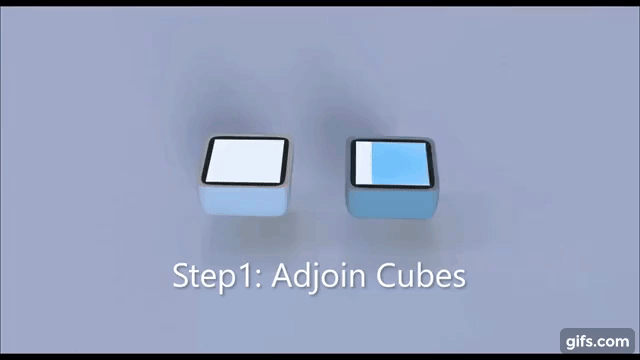
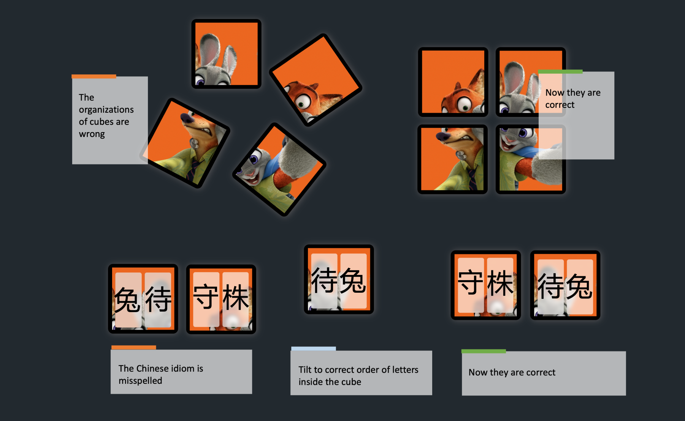
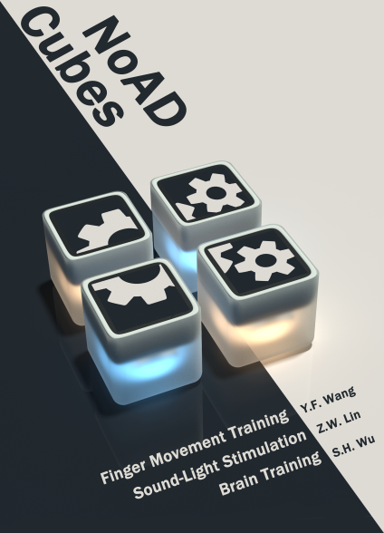
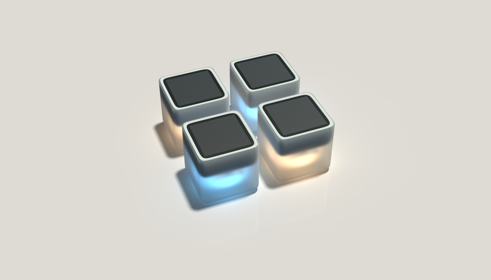
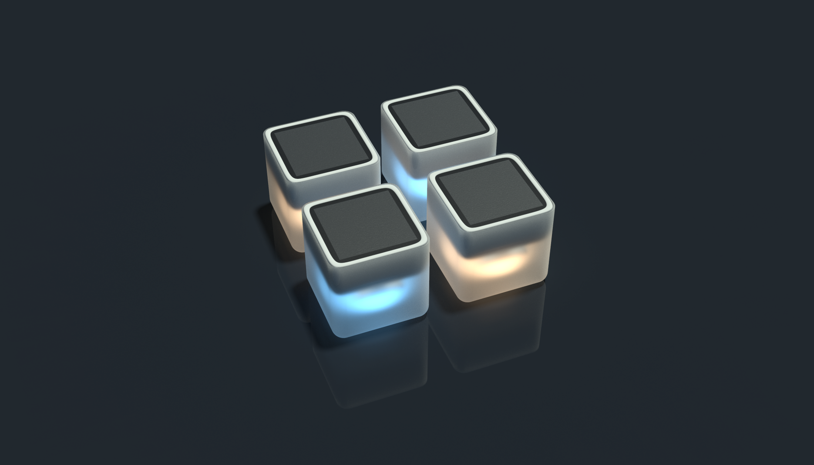

# Games developed for Sifteo Cubes

Playlist for all my project demos: https://www.youtube.com/playlist?list=PL64LAgbUtjSCP0Z1GdlZDkMYNDYfnM_ew

## The dyer game

Source under [dyer folder](./dyer/).

This is an conceptual demo made with After Effects & Keyshot 9.

## The wordgame

Source file under [wordgame folder](./wordgame/).

The post:

